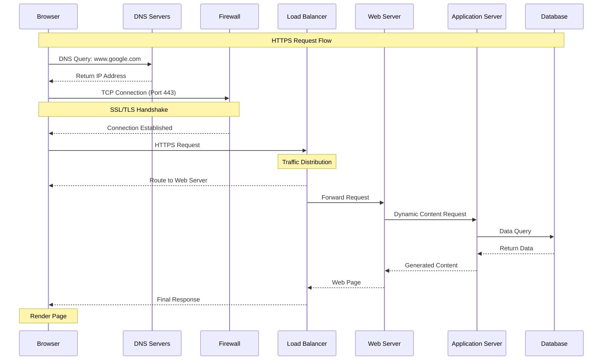

# 🌐 Request Flow Diagram: What happens when you type https://www.google.com

## 📊 Diagram

## 📝 Step-by-Step Explanation

1. **🔍 DNS Resolution**
   - Browser initiates DNS query for "www.google.com"
   - Query goes through local cache → OS cache → ISP DNS → Root DNS → TLD DNS → Authoritative DNS
   - Returns IP address to browser

2. **🔌 TCP Connection & 🛡️ Firewall**
   - Browser initiates TCP connection on port 443 (HTTPS)
   - Connection must pass through:
     - Local firewall
     - Google's firewall
   - SSL/TLS handshake establishes secure connection

3. **⚖️ Load Balancer**
   - Request reaches Google's load balancer
   - Load balancer:
     - Checks server health
     - Applies load balancing algorithm
     - Routes to appropriate web server

4. **🌐 Web Server**
   - Receives request
   - Handles static content
   - Forwards dynamic content requests to application server

5. **⚡ Application Server**
   - Processes business logic
   - Generates dynamic content
   - Manages user sessions
   - Interacts with database

6. **💾 Database**
   - Receives queries from application server
   - Returns requested data
   - Manages data consistency

7. **🔄 Response Flow**
   - Database → Application Server: Returns data
   - Application Server → Web Server: Sends generated content
   - Web Server → Load Balancer: Sends complete web page
   - Load Balancer → Browser: Delivers final response
   - Browser renders the page

## ✨ Key Features Illustrated

- 🔒 **Encryption**: SSL/TLS handshake shown in the diagram
- 🛡️ **Security**: Firewall checkpoints included
- ⚖️ **Load Balancing**: Traffic distribution mechanism
- 🔄 **Request Flow**: Clear visualization of request/response cycle
- 💾 **Data Flow**: Database interaction shown
- 🌐 **Web Stack**: Complete web stack components included

## 🔧 Technical Details

- **🔌 Ports**: Uses port 443 for HTTPS
- **📡 Protocols**: Shows HTTPS and TCP/IP
- **⚙️ Components**: Includes all required infrastructure elements
- **🔄 Flow**: Demonstrates both request and response paths
- **🔒 Security**: Illustrates encryption and firewall checks

https://www.linkedin.com/pulse/journey-web-request-from-browser-google-back-judith-espinal-mart%25C3%25ADnez-cique
